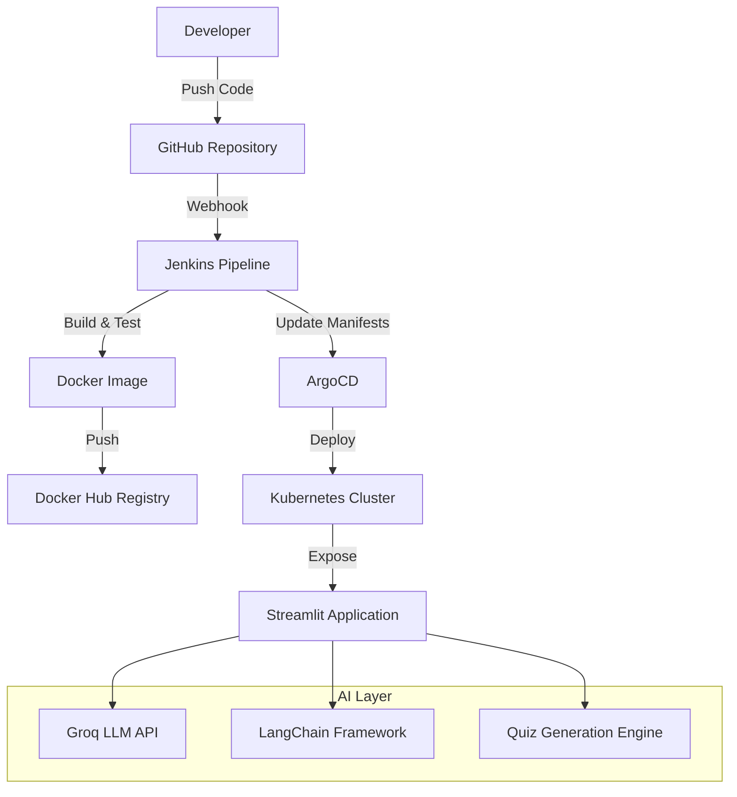
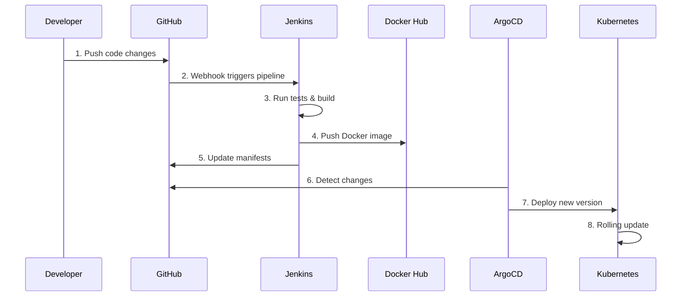

# 🧠 AI-Powered Quiz Platform with CI/CD Pipeline

[](https://github.com/riteshbandaru/AI-Powered-Quiz-Platform-with-CI-CD-Pipeline/stargazers)
[](https://github.com/riteshbandaru/AI-Powered-Quiz-Platform-with-CI-CD-Pipeline/network)
[](https://github.com/riteshbandaru/AI-Powered-Quiz-Platform-with-CI-CD-Pipeline/issues)
[](https://opensource.org/licenses/MIT)
[](https://www.docker.com/)
[](https://kubernetes.io/)

> An intelligent quiz platform built with Streamlit, powered by **Groq LLM** and **LangChain**, deployed using modern DevOps practices including Docker, Kubernetes, Jenkins CI/CD, and ArgoCD GitOps workflow.

## 🌟 Features

### 🤖 AI-Powered Intelligence
- **Groq LLM Integration**: Lightning-fast quiz generation using Groq's high-performance language models
- **LangChain Framework**: Advanced prompt engineering and chain-of-thought reasoning
- **Intelligent Quiz Creation**: Context-aware question generation with difficulty scaling
- **Multi-Domain Support**: Generate quizzes across various subjects and topics
- **Real-time AI Processing**: Instant quiz generation with optimized response times

### 🎯 Platform Features
- **Interactive Web Interface**: Built with Streamlit for seamless user experience
- **Dynamic Question Types**: Multiple choice, true/false, and open-ended questions
- **Adaptive Difficulty**: AI-driven difficulty adjustment based on user performance
- **Progress Tracking**: Real-time scoring and performance analytics
- **Export Capabilities**: Save quizzes in multiple formats (JSON, PDF, CSV)

### 🚀 DevOps & Infrastructure
- **Containerized Deployment**: Dockerized application for consistent environments
- **CI/CD Pipeline**: Automated build, test, and deployment using Jenkins
- **GitOps Workflow**: ArgoCD for declarative continuous delivery
- **Kubernetes Orchestration**: Scalable deployment on Kubernetes clusters
- **Automated Testing**: Comprehensive testing pipeline integration
- **Monitoring & Logging**: Built-in observability and error tracking

## 🏗️ Architecture



**Complete GitOps Workflow:**
```
GitHub Repository → Jenkins Pipeline → Docker Hub → ArgoCD → Kubernetes Cluster
```

The application follows a modern microservices architecture with:
- **Source Code Management**: GitHub repository with webhook integration
- **Continuous Integration**: Jenkins pipeline for automated builds
- **Container Registry**: Docker Hub for image storage and versioning
- **Continuous Deployment**: ArgoCD for Kubernetes deployments
- **Orchestration**: Minikube/Kubernetes for container management
- **AI Processing**: Groq LLM + LangChain for intelligent quiz generation


## 📋 Prerequisites

Before starting, ensure you have the following accounts and basic knowledge:

### Required Accounts
- ✅ **Google Cloud Platform** account
- ✅ **GitHub** account  
- ✅ **Docker Hub** account
- ✅ **Groq API** access ([Get API Key](https://console.groq.com/))

### Required Knowledge
- 🐳 Basic Docker concepts
- ☸️ Kubernetes fundamentals
- 🔄 CI/CD pipeline concepts
- 🐍 Python programming
- 🤖 Basic understanding of LLMs and AI

### System Requirements
- **OS**: Ubuntu 24.04 LTS (recommended)
- **RAM**: 16 GB minimum
- **Storage**: 256 GB SSD
- **CPU**: 4+ cores

## 🛠️ Technology Stack

### Frontend & Backend
- **Framework**: [Streamlit](https://streamlit.io/) - Interactive web applications
- **Language**: Python 3.9+
- **AI Framework**: [LangChain](https://langchain.com/) - LLM application framework
- **LLM Provider**: [Groq](https://groq.com/) - High-performance inference

### AI & Machine Learning
- **Language Model**: Groq LLaMA, Mixtral, and Gemma models
- **Prompt Engineering**: LangChain prompt templates
- **Vector Store**: ChromaDB (optional for RAG)
- **Text Processing**: NLTK, spaCy

### DevOps & Infrastructure
- **Containerization**: Docker & Docker Compose
- **Orchestration**: Kubernetes (Minikube for local)
- **CI/CD**: Jenkins Pipeline
- **GitOps**: ArgoCD
- **Container Registry**: Docker Hub
- **Cloud Provider**: Google Cloud Platform
- **Monitoring**: Prometheus + Grafana (optional)

### Development Tools
- **Version Control**: Git & GitHub
- **Code Quality**: Black, Flake8, pytest
- **Documentation**: Sphinx, MkDocs
- **Environment Management**: Poetry, pip-tools

## 🚀 Quick Start

### 1. Clone the Repository
```bash
git clone https://github.com/riteshbandaru/AI-Powered-Quiz-Platform-with-CI-CD-Pipeline.git
cd AI-Powered-Quiz-Platform-with-CI-CD-Pipeline
```

### 2. Local Development Setup
```bash
# Create virtual environment
python -m venv quiz_env
source quiz_env/bin/activate  # On Windows: quiz_env\Scripts\activate

# Install dependencies
pip install -r requirements.txt

# Set up environment variables
cp .env.example .env
# Edit .env file with your API keys
```

### 3. Configure Environment Variables
```bash
# .env file
GROQ_API_KEY=your_groq_api_key_here
LANGCHAIN_TRACING_V2=true
LANGCHAIN_API_KEY=your_langchain_api_key_here
STREAMLIT_SERVER_PORT=8501
STREAMLIT_SERVER_ADDRESS=0.0.0.0
```

### 4. Run Locally
```bash
# Start the application
streamlit run app/app.py

# Access the application
# Open http://localhost:8501 in your browser
```

### 5. Docker Quick Start
```bash
# Build and run with Docker
docker build -t quiz-platform .
docker run -p 8501:8501 --env-file .env quiz-platform
```

## 🔧 Complete Setup Guide

### Phase 1: Initial Setup and Code Preparation

#### 1. Prepare Your Environment
```bash
# Clone the repository
git clone https://github.com/riteshbandaru/AI-Powered-Quiz-Platform-with-CI-CD-Pipeline.git
cd AI-Powered-Quiz-Platform-with-CI-CD-Pipeline

# Verify project structure
ls -la
```

#### 2. Dockerfile Configuration
The repository includes a production-ready Dockerfile:

```dockerfile
FROM python:3.9-slim

# Set working directory
WORKDIR /app

# Copy requirements and install dependencies
COPY requirements.txt .
RUN pip install --no-cache-dir -r requirements.txt

# Copy application code
COPY app/ ./app/
COPY .env .env

# Expose port
EXPOSE 8501

# Health check
HEALTHCHECK CMD curl --fail http://localhost:8501/_stcore/health

# Start application
ENTRYPOINT ["streamlit", "run"]
CMD ["app/app.py", "--server.port=8501", "--server.address=0.0.0.0"]
```

#### 3. Requirements.txt
```txt
streamlit==1.28.1
groq==0.4.1
langchain==0.1.0
langchain-groq==0.0.3
python-dotenv==1.0.0
pandas==2.1.3
numpy==1.24.3
requests==2.31.0
pydantic==2.5.0
chromadb==0.4.18
nltk==3.8.1
spacy==3.7.2
pytest==7.4.3
black==23.11.0
flake8==6.1.0
```

### Phase 2: Google Cloud VM Instance Setup

#### 1. Create VM Instance
```bash
# VM Configuration
Name: gitops-quiz-platform
Machine Type: e2-standard-4 (4 vCPUs, 16 GB memory)
Boot Disk: 256 GB, Ubuntu 24.04 LTS
Zone: us-central1-a (or your preferred zone)
Networking: Enable HTTP and HTTPS traffic
```

#### 2. Connect and Configure VM
```bash
# Connect via SSH
gcloud compute ssh gitops-quiz-platform --zone=us-central1-a

# Update system
sudo apt-get update && sudo apt-get upgrade -y

# Install essential packages
sudo apt-get install -y curl wget git vim htop
```

#### 3. Install Docker
```bash
# Add Docker's official GPG key
sudo apt-get update
sudo apt-get install ca-certificates curl
sudo install -m 0755 -d /etc/apt/keyrings
sudo curl -fsSL https://download.docker.com/linux/ubuntu/gpg -o /etc/apt/keyrings/docker.asc
sudo chmod a+r /etc/apt/keyrings/docker.asc

# Add the repository to Apt sources
echo \
  "deb [arch=$(dpkg --print-architecture) signed-by=/etc/apt/keyrings/docker.asc] https://download.docker.com/linux/ubuntu \
  $(. /etc/os-release && echo "$VERSION_CODENAME") stable" | \
  sudo tee /etc/apt/sources.list.d/docker.list > /dev/null

# Install Docker packages
sudo apt-get update
sudo apt-get install docker-ce docker-ce-cli containerd.io docker-buildx-plugin docker-compose-plugin

# Test Docker installation
docker --version
sudo docker run hello-world
```

#### 4. Configure Docker for Non-root User
```bash
# Add user to docker group
sudo groupadd docker
sudo usermod -aG docker $USER
newgrp docker

# Test docker without sudo
docker run hello-world

# Enable Docker to start on boot
sudo systemctl enable docker.service
sudo systemctl enable containerd.service
```

### Phase 3: Minikube and Kubernetes Setup

#### 1. Install Minikube
```bash
# Download and install Minikube
curl -LO https://storage.googleapis.com/minikube/releases/latest/minikube-linux-amd64
sudo install minikube-linux-amd64 /usr/local/bin/minikube && rm minikube-linux-amd64

# Verify installation
minikube version
```

#### 2. Start Minikube Cluster
```bash
# Start cluster with adequate resources
minikube start --cpus=4 --memory=8192 --disk-size=50gb

# Enable required addons
minikube addons enable dashboard
minikube addons enable metrics-server
minikube addons enable ingress
```

#### 3. Install kubectl
```bash
# Install kubectl using snap
sudo snap install kubectl --classic

# Verify installation
kubectl version --client
kubectl cluster-info
```

#### 4. Verify Kubernetes Setup
```bash
# Check cluster status
minikube status
kubectl get nodes
kubectl get namespaces

# Access dashboard (optional)
minikube dashboard --url &
```

### Phase 4: Jenkins Setup and Configuration

#### 1. Run Jenkins in Docker (DIND Mode)
```bash
# Create docker network for Jenkins
docker network create jenkins-network

# Run Jenkins with Docker-in-Docker support
docker run -d --name jenkins \
  -p 8080:8080 \
  -p 50000:50000 \
  -v jenkins_home:/var/jenkins_home \
  -v /var/run/docker.sock:/var/run/docker.sock \
  -v $(which docker):/usr/bin/docker \
  -u root \
  --network jenkins-network \
  jenkins/jenkins:lts

# Verify Jenkins is running
docker ps | grep jenkins
```

#### 2. Access Jenkins Web UI
```bash
# Get initial admin password
docker logs jenkins 2>&1 | grep -A 5 -B 5 "Administrator password"

# Create firewall rule for Jenkins (if needed)
gcloud compute firewall-rules create allow-jenkins \
  --allow tcp:8080 \
  --source-ranges 0.0.0.0/0 \
  --description "Allow Jenkins access"
```

**Access Jenkins at**: `http://<VM_EXTERNAL_IP>:8080`

#### 3. Jenkins Initial Setup
1. Enter the initial admin password
2. Click **"Install Suggested Plugins"**
3. Create an admin user:
   - Username: `admin`
   - Password: `your_secure_password`
   - Full name: `Jenkins Admin`
   - Email: `your_email@domain.com`
4. Complete the setup wizard

#### 4. Install Required Plugins
Navigate to **Manage Jenkins → Plugins** and install:
- Docker
- Docker Pipeline
- Kubernetes
- GitHub
- Pipeline: GitHub Groovy Libraries
- Blue Ocean (optional, for better UI)

#### 5. Install Python in Jenkins Container
```bash
# Execute into Jenkins container
docker exec -it jenkins bash

# Install Python and pip
apt update -y
apt install -y python3 python3-pip python3-venv

# Create symlink
ln -s /usr/bin/python3 /usr/bin/python

# Verify installation
python --version
pip --version

# Exit container
exit

# Restart Jenkins
docker restart jenkins
```

### Phase 5: GitHub Integration with Jenkins

#### 1. Generate GitHub Personal Access Token
1. Go to **GitHub → Settings → Developer Settings → Personal Access Tokens**
2. Click **"Generate new token (classic)"**
3. Select scopes:
   - `repo` (Full control of private repositories)
   - `admin:repo_hook` (Read and write repository hooks)
   - `admin:org_hook` (Admin org hooks)
   - `workflow` (Update GitHub Action workflows)
4. Copy the generated token

#### 2. Add GitHub Credentials to Jenkins
1. Go to **Manage Jenkins → Credentials → Global → Add Credentials**
2. Configure:
   - **Kind**: Username with password
   - **Username**: Your GitHub username
   - **Password**: The generated token
   - **ID**: `github-token`
   - **Description**: `GitHub Access Token`

#### 3. Create Jenkins Pipeline Job
1. Go to **Jenkins Dashboard → New Item**
2. Enter name: `quiz-platform-pipeline`
3. Select **Pipeline**
4. In **Pipeline** section:
   - **Definition**: Pipeline from SCM
   - **SCM**: Git
   - **Repository URL**: `https://github.com/riteshbandaru/AI-Powered-Quiz-Platform-with-CI-CD-Pipeline.git`
   - **Credentials**: Select `github-token`
   - **Branch**: `*/main`
   - **Script Path**: `jenkins/Jenkinsfile`

### Phase 6: Docker Hub Integration

#### 1. Configure Docker Tool in Jenkins
1. Go to **Manage Jenkins → Tools**
2. Scroll to **Docker Installations**
3. Add Docker:
   - **Name**: `Docker`
   - **Install automatically**: ✅
   - **Install from**: docker.com

#### 2. Create DockerHub Repository
1. Go to [Docker Hub](https://hub.docker.com/)
2. Click **Create Repository**
3. Repository Details:
   - **Name**: `ai-quiz-platform`
   - **Visibility**: Public
   - **Description**: AI-Powered Quiz Platform with Groq LLM

#### 3. Generate DockerHub Access Token
1. Go to **DockerHub → Account Settings → Security**
2. Click **New Access Token**
3. Configure:
   - **Access Token Description**: `Jenkins CI/CD`
   - **Access permissions**: Read, Write, Delete

#### 4. Add DockerHub Credentials to Jenkins
1. Go to **Manage Jenkins → Credentials → Global → Add Credentials**
2. Configure:
   - **Kind**: Username with password
   - **Username**: Your DockerHub username
   - **Password**: DockerHub access token
   - **ID**: `docker-hub-credentials`
   - **Description**: `DockerHub Access Token`

### Phase 7: ArgoCD Installation and Configuration

#### 1. Install ArgoCD
```bash
# Create ArgoCD namespace
kubectl create namespace argocd

# Install ArgoCD
kubectl apply -n argocd -f https://raw.githubusercontent.com/argoproj/argo-cd/stable/manifests/install.yaml

# Wait for all components to be ready
kubectl wait --for=condition=available --timeout=300s deployment/argocd-server -n argocd

# Verify installation
kubectl get all -n argocd
```

#### 2. Expose ArgoCD Server
```bash
# Change service type to NodePort
kubectl patch svc argocd-server -n argocd -p '{"spec":{"type":"NodePort"}}'

# Get the NodePort
kubectl get svc argocd-server -n argocd

# Port forward for access
kubectl port-forward --address 0.0.0.0 service/argocd-server 31704:443 -n argocd &
```

#### 3. Create Firewall Rule for ArgoCD
```bash
# Create firewall rule
gcloud compute firewall-rules create allow-argocd \
  --allow tcp:31704 \
  --source-ranges 0.0.0.0/0 \
  --description "Allow ArgoCD access"
```

#### 4. Access ArgoCD UI
**URL**: `https://<VM_EXTERNAL_IP>:31704`

#### 5. Get ArgoCD Admin Password
```bash
# Get initial admin password
kubectl get secret argocd-initial-admin-secret -n argocd -o jsonpath="{.data.password}" | base64 -d && echo

# Login credentials:
# Username: admin
# Password: <output_from_above_command>
```

#### 6. Configure Kubernetes Access in Jenkins
```bash
# Get kubeconfig content
cat ~/.kube/config

# Convert certificates to base64
cat ~/.minikube/ca.crt | base64 -w 0 && echo
cat ~/.minikube/profiles/minikube/client.crt | base64 -w 0 && echo
cat ~/.minikube/profiles/minikube/client.key | base64 -w 0 && echo
```

1. Create a modified kubeconfig with base64 data
2. Add as **Secret File** in Jenkins with ID: `kubeconfig`

### Phase 8: ArgoCD Application Setup

#### 1. Connect GitHub Repository to ArgoCD
1. In ArgoCD UI: **Settings → Repositories → Connect Repo via HTTPS**
2. Configure:
   - **Type**: git
   - **Name**: quiz-platform-repo
   - **Project**: default
   - **Repository URL**: `https://github.com/riteshbandaru/AI-Powered-Quiz-Platform-with-CI-CD-Pipeline.git`

#### 2. Create ArgoCD Application
1. Go to **Applications → New App**
2. Configure:
   - **Application Name**: `quiz-platform`
   - **Project**: `default`
   - **Sync Policy**: Automatic
   - **Self Heal**: ✅
   - **Prune Resources**: ✅
   - **Repository URL**: Your connected repository
   - **Revision**: `main`
   - **Path**: `manifests`
   - **Cluster URL**: `https://kubernetes.default.svc`
   - **Namespace**: `default`

### Phase 9: Webhook Configuration

#### 1. Add GitHub Webhook
1. Go to **GitHub Repository → Settings → Webhooks → Add Webhook**
2. Configure:
   - **Payload URL**: `http://<JENKINS_EXTERNAL_IP>:8080/github-webhook/`
   - **Content Type**: `application/json`
   - **Events**: Just the push event
   - **SSL verification**: Disable for testing

#### 2. Configure Jenkins Build Trigger
In Jenkins pipeline configuration:
1. Enable **GitHub hook trigger for GITScm polling**
2. Save the configuration

## 📝 Pipeline Configuration

### Jenkinsfile
```groovy
pipeline {
    agent any
    
    environment {
        DOCKER_HUB_REPO = "riteshbandaru/ai-quiz-platform"
        DOCKER_HUB_CREDENTIALS_ID = "docker-hub-credentials"
        IMAGE_TAG = "v${BUILD_NUMBER}"
        KUBECONFIG_CREDENTIALS_ID = "kubeconfig"
    }
    
    stages {
        stage('Checkout') {
            steps {
                echo '🔄 Checking out code from GitHub...'
                checkout scmGit(
                    branches: [[name: '*/main']], 
                    extensions: [], 
                    userRemoteConfigs: [[
                        credentialsId: 'github-token', 
                        url: 'https://github.com/riteshbandaru/AI-Powered-Quiz-Platform-with-CI-CD-Pipeline.git'
                    ]]
                )
            }
        }
        
        stage('Code Quality & Testing') {
            parallel {
                stage('Lint Code') {
                    steps {
                        echo '🔍 Running code quality checks...'
                        sh '''
                            python -m pip install --upgrade pip
                            pip install flake8 black
                            black --check app/ || echo "Code formatting issues found"
                            flake8 app/ --max-line-length=88 || echo "Linting issues found"
                        '''
                    }
                }
                stage('Run Tests') {
                    steps {
                        echo '🧪 Running tests...'
                        sh '''
                            pip install -r requirements.txt
                            python -m pytest tests/ -v || echo "Some tests failed"
                        '''
                    }
                }
            }
        }
        
        stage('Build Docker Image') {
            steps {
                script {
                    echo '🐳 Building Docker image...'
                    dockerImage = docker.build("${DOCKER_HUB_REPO}:${IMAGE_TAG}")
                    dockerImage.tag("latest")
                }
            }
        }
        
        stage('Push to DockerHub') {
            steps {
                script {
                    echo '📤 Pushing Docker image to DockerHub...'
                    docker.withRegistry('https://registry.hub.docker.com', "${DOCKER_HUB_CREDENTIALS_ID}") {
                        dockerImage.push("${IMAGE_TAG}")
                        dockerImage.push("latest")
                    }
                }
            }
        }
        
        stage('Update Kubernetes Manifests') {
            steps {
                echo '📝 Updating Kubernetes manifests...'
                sh """
                    sed -i 's|${DOCKER_HUB_REPO}:.*|${DOCKER_HUB_REPO}:${IMAGE_TAG}|g' manifests/deployment.yaml
                    git add manifests/deployment.yaml
                    git commit -m "Update image to ${IMAGE_TAG}" || echo "No changes to commit"
                    git push origin main || echo "Nothing to push"
                """
            }
        }
        
        stage('Trigger ArgoCD Sync') {
            steps {
                echo '🔄 Triggering ArgoCD sync...'
                // ArgoCD will automatically detect changes and sync
                sh 'echo "ArgoCD will detect changes automatically"'
            }
        }
    }
    
    post {
        always {
            echo '🧹 Cleaning up...'
            cleanWs()
        }
        success {
            echo '✅ Pipeline completed successfully!'
        }
        failure {
            echo '❌ Pipeline failed!'
        }
    }
}
```

### Kubernetes Manifests

#### deployment.yaml
```yaml
apiVersion: apps/v1
kind: Deployment
metadata:
  name: quiz-platform-deployment
  labels:
    app: quiz-platform
spec:
  replicas: 3
  selector:
    matchLabels:
      app: quiz-platform
  template:
    metadata:
      labels:
        app: quiz-platform
    spec:
      containers:
      - name: quiz-platform
        image: riteshbandaru/ai-quiz-platform:latest
        ports:
        - containerPort: 8501
        env:
        - name: GROQ_API_KEY
          valueFrom:
            secretKeyRef:
              name: quiz-platform-secrets
              key: groq-api-key
        - name: LANGCHAIN_API_KEY
          valueFrom:
            secretKeyRef:
              name: quiz-platform-secrets
              key: langchain-api-key
        resources:
          requests:
            memory: "512Mi"
            cpu: "250m"
          limits:
            memory: "1Gi"
            cpu: "500m"
        livenessProbe:
          httpGet:
            path: /_stcore/health
            port: 8501
          initialDelaySeconds: 30
          periodSeconds: 10
        readinessProbe:
          httpGet:
            path: /_stcore/health
            port: 8501
          initialDelaySeconds: 5
          periodSeconds: 5
---
apiVersion: v1
kind: Secret
metadata:
  name: quiz-platform-secrets
type: Opaque
stringData:
  groq-api-key: "your-groq-api-key-here"
  langchain-api-key: "your-langchain-api-key-here"
```

#### service.yaml
```yaml
apiVersion: v1
kind: Service
metadata:
  name: quiz-platform-service
  labels:
    app: quiz-platform
spec:
  type: LoadBalancer
  ports:
  - port: 80
    targetPort: 8501
    protocol: TCP
  selector:
    app: quiz-platform
```

#### configmap.yaml
```yaml
apiVersion: v1
kind: ConfigMap
metadata:
  name: quiz-platform-config
data:
  STREAMLIT_SERVER_PORT: "8501"
  STREAMLIT_SERVER_ADDRESS: "0.0.0.0"
  STREAMLIT_SERVER_HEADLESS: "true"
  STREAMLIT_BROWSER_GATHER_USAGE_STATS: "false"
```

## 🚀 Deployment Process

### Automated GitOps Workflow



1. **Developer** pushes code to GitHub repository
2. **GitHub webhook** triggers Jenkins pipeline automatically
3. **Jenkins pipeline** executes:
   - Checks out latest code
   - Runs code quality checks and tests
   - Builds Docker image with version tag
   - Pushes image to Docker Hub
   - Updates Kubernetes manifests
4. **ArgoCD** detects changes in the
